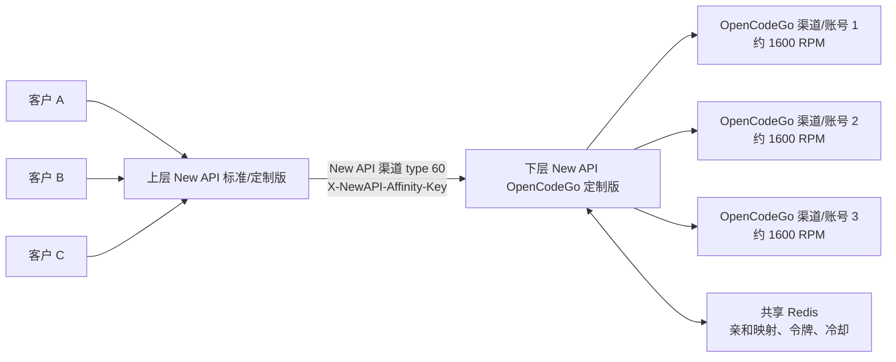
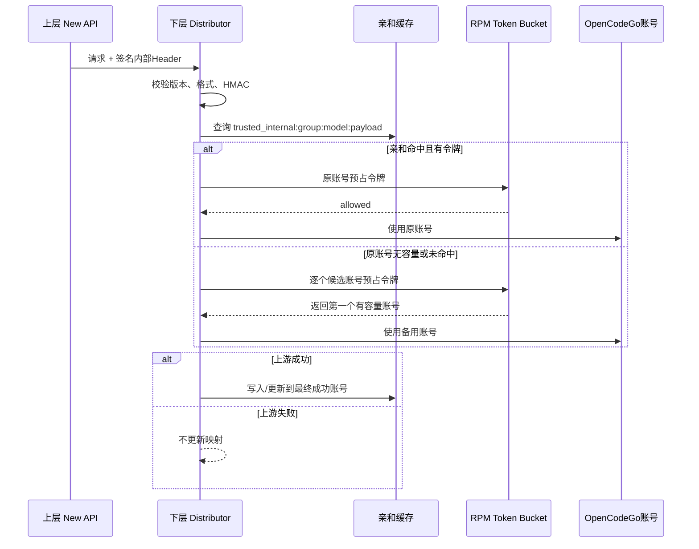

# OpenCodeGo 多账号亲和与 RPM 保护：背景、实现与 Review 指南

> 文档目的：给后续模型和工程师提供完整、可复核的上下文。本文描述的是当前工作区中的实现状态，不是纯设计草案。Review 时应同时阅读本文列出的代码文件和测试，不能只依据本文判断实现正确性。
>
> 最后核对日期：2026-08-15（Asia/Shanghai）

## 1. 结论摘要

当前方案用于解决以下冲突：

- 单个 OpenCodeGo 账号的上游硬限制约为 1600 RPM；
- 一个账号对应一个 New API 渠道；
- 上层标准版 New API 有多个客户，但客户不会提供新的租户或会话字段；
- 使用多个账号随机分流可以提高总吞吐量，却会破坏账号级提示缓存命中；
- 将一个客户永久固定到一个账号，又会在该客户或热点会话超过 1600 RPM 时持续收到 429。

当前实现采用“缓存亲和优先、容量不足时可迁移”的折中策略：

1. 上层仅在最终选择 New API 渠道（type 60）时生成签名内部亲和 Header。
2. 下层验证 Header 后，把同一个内部亲和键优先路由到之前成功的 OpenCodeGo 渠道。
3. 下层通过 Redis Token Bucket 对每个 OpenCodeGo 渠道执行 RPM 软限制。
4. 亲和账号没有容量时，尝试同组其他账号；自动分组下当前组饱和时继续尝试后续组。
5. 只有备用账号请求成功后才更新亲和映射；失败不会错误迁移。
6. 所有可选账号均饱和时返回 429，并携带最短 `Retry-After`。
7. 实际收到 OpenCodeGo 429 时设置临时冷却，不永久自动禁用渠道。

该方案无法同时实现“单个真实会话永远保持同一账号缓存”和“该会话突破单账号 1600 RPM”。达到账号容量时迁移会造成一次或短期缓存未命中，这是明确接受的可用性优先取舍。

## 2. 业务拓扑与问题来源

部署拓扑：



初始状态已经满足“一个 OpenCodeGo 账号对应一个渠道”。仍未解决的是：上层只有一个指向下层的渠道，多个客户的请求到达下层后，如果没有可信且稳定的亲和标识，下层无法兼顾缓存和账号容量。

### 2.1 为什么不能只按客户固定账号

上层可以识别 `token_id`，但 `token_id` 只代表客户，不代表会话。只用它做亲和会导致：

- 一个高流量客户的所有会话都进入同一账号；
- 该客户超过 1600 RPM 后，即使其他账号空闲仍持续429；
- 客户间可能均衡，但客户内部无法扩展。

因此 `token_id` 只用于客户命名空间隔离，绝不单独作为亲和键。

### 2.2 为什么不能直接相信 session 或 metadata

- `x-opencode-session` 可能是用户级、设备级或长期复用值；
- `metadata.user_id` 从语义上通常是用户标识，不保证是会话标识；
- 同一用户所有请求使用相同值时，单独使用这些字段仍会形成账号热点。

当前策略是：除 `prompt_cache_key` 外，session、metadata 和 fallback 都必须与稳定请求指纹组合。

### 2.3 为什么不能完全随机分流

OpenCodeGo 的缓存不能跨账号共享。完全随机分流会让相同会话不断落到不同账号，显著降低缓存命中，并可能增加上游费用和首 Token 延迟。

## 3. 已确认的设计取舍

- 上下层均使用同一套定制版本，客户不需要修改请求。
- 可用性优先：亲和账号达到软限制或进入429冷却时允许迁移。
- `prompt_cache_key` 是最高优先级来源。
- `x-opencode-session` 默认开启，但必须与稳定请求指纹组合。
- `metadata.user_id` 默认关闭；开启后仍必须与稳定指纹组合。
- 没有可靠字段时可根据稳定请求前缀生成 fallback 键。
- 上层只生成签名 Header；账号选择、Redis限流和迁移都在下层完成。
- Redis故障时 RPM保护 fail-open，避免 Redis 故障演变为全站不可用。

## 4. 当前配置与准确语义

配置定义位于 `setting/operation_setting/channel_affinity_setting.go`。

| 配置 | 当前默认值 | 当前实现语义 |
|---|---:|---|
| `enabled` | 开启 | 旧亲和规则总开关；当前内部亲和消费和成功写回也依赖它。 |
| `accept_internal_key` | 关闭 | 下层是否验证并使用 `X-NewAPI-Affinity-Key`。 |
| `generate_internal_key` | 关闭 | 上层选中 type 60 渠道时是否生成内部亲和 Header。 |
| `use_prompt_cache_key` | 开启 | 存在时作为最高优先级来源，不依赖稳定指纹。 |
| `use_opencode_session` | 开启 | 允许使用 `x-opencode-session`，必须组合稳定指纹。 |
| `use_metadata_user_id` | 关闭 | 允许使用 `metadata.user_id`，必须组合稳定指纹。 |
| `generate_fallback_key` | 开启 | 没有上述来源时使用稳定指纹。 |
| `max_source_bytes` | 32768 | 稳定内容收集器的目标上限；参见“已知风险”，目前并非所有前置序列化都受此上限约束。 |
| `affinity_ttl_seconds` | 3600 | 可信内部亲和映射 TTL。 |
| `rpm_guard_enabled` | 关闭 | 是否启用 OpenCodeGo 渠道级 Redis Token Bucket。 |
| `default_account_rpm` | 1450 | 渠道未配置覆盖值时的软限制。 |
| `account_burst` | 50 | Token Bucket容量，不允许空闲后一次释放完整一分钟额度。 |
| `rate_limit_cooldown_seconds` | 10 | 实际429没有有效 `Retry-After` 时的默认冷却秒数。 |
| `overload_policy` | `availability_first` | 当前仅有这一种行为，后端尚未根据该字段切换策略。 |

OpenCodeGo 渠道扩展设置：

```json
{
  "opencodego_rpm_limit": 0
}
```

- `0`：继承 `default_account_rpm`；
- 大于0：覆盖该渠道软限制；
- 小于0：当前校验拒绝；
- 存储在现有渠道扩展设置中，没有新增数据库列。

## 5. 密钥与安全边界

### 5.1 `AFFINITY_SECRET`

专门用于内部亲和 Header 的 payload HMAC 和签名。所有上层、下层节点必须配置相同值。未配置时回退到 `CRYPTO_SECRET`。

Header固定为：

```text
X-NewAPI-Affinity-Key: v1.<payload-base64url>.<signature-base64url>
```

算法：

```text
payload   = HMAC-SHA256(affinity_secret, source) 前16字节
signature = HMAC-SHA256(affinity_secret, "v1." + payload) 前16字节
```

安全行为：

- 客户传入的同名 Header 会被上层生成值覆盖；
- 下层拒绝错误版本、错误长度、错误 Base64 和错误签名；
- 验证失败时忽略内部 Header，继续尝试旧亲和规则；
- 内部 Header 被通配 Header 透传逻辑显式过滤，不会发送给 OpenCodeGo；
- 日志使用短指纹，不应记录原始用户ID、session或提示词。

### 5.2 `CRYPTO_SECRET`

这是 New API 的通用 HMAC密钥，现有代码还将它用于 Token缓存键、文件缓存键等摘要。未显式配置时，它回退到 `SESSION_SECRET`；如果 `SESSION_SECRET` 也未固定，不同进程可能获得不同随机值。

当前稳定请求指纹使用 `CRYPTO_SECRET`，最终内部 Header 使用 `AFFINITY_SECRET`。因此：

- 所有上层节点的 `CRYPTO_SECRET` 必须一致；
- 所有上下层节点的 `AFFINITY_SECRET` 必须一致；
- 两类密钥不要求彼此相同，建议安全隔离；
- 只统一 `AFFINITY_SECRET`、但上层节点的 `CRYPTO_SECRET` 不一致时，session/metadata/fallback路径仍会生成不同的内部键。

推荐部署：

```env
CRYPTO_SECRET=<所有上层节点一致的固定随机值>
AFFINITY_SECRET=<所有上下层节点一致的另一固定随机值>
```

## 6. 上层亲和键生成

入口位于 `relay/channel/newapi/adaptor.go`，因此只对最终选中的 New API type 60 渠道执行。

当前优先级已经修正为：

1. `prompt_cache_key`；
2. `x-opencode-session`；
3. `metadata.user_id`（仅开关开启时）；
4. fallback稳定指纹。

组合规则：

```text
prompt_cache_key:
token_id | model | protocol | source_type | prompt_cache_key

session / metadata:
token_id | model | protocol | source_type | source_value | stable_fingerprint

fallback:
token_id | model | protocol | fallback | stable_fingerprint
```

其中 `source_type` 也进入源串，避免相同文本来自不同字段时发生语义碰撞。

### 6.1 稳定指纹内容

- Chat Completions：system/developer消息、tools、第一条user消息；
- Claude Messages：system、tools、第一条user消息；
- Responses：instructions、tools、最早的 `type=message, role=user` 输入；
- Responses 的 `function_call_output` 等非 message 项已明确跳过；
- Chat多模态内容中的 data URL 不进入稳定文本；
- 收集器达到 `max_source_bytes` 后停止追加。

## 7. 下层亲和消费与成功写回

入口位于 `service/channel_affinity.go`，渠道分配发生在 `middleware/distributor.go`。



可信内部缓存键包含：

```text
trusted_internal : using_group : model : payload
```

成功写回由 Distributor 在响应状态小于400时调用 `RecordChannelAffinity`。这确保备用账号失败不会覆盖原映射。

## 8. RPM保护和429处理

### 8.1 Redis键

```text
opencodego:rpm:{channel_id}
opencodego:cooldown:{channel_id}
opencodego:rpm_count:{channel_id}:{unix_minute}
```

Token Bucket通过 Redis Lua脚本原子执行：

- refill速率：`rpm_limit / 60` 每秒；
- capacity：`account_burst`；
- 每个请求预占1个令牌；
- 冷却优先于令牌判断；
- Redis异常时允许请求继续，即 fail-open。

### 8.2 同组选择

`selectChannelWithRPMCapacity` 使用排除集合循环选择：

1. 按现有优先级和权重选择候选渠道；
2. OpenCodeGo渠道预占令牌；
3. 无容量则把该渠道加入本次选择的排除集合；
4. 尝试同组其他候选；
5. 同组候选全部饱和时返回带最短等待时间的 `OpenCodeGoRPMError`。

非 OpenCodeGo 渠道、RPM保护关闭或 Redis不可用时不会因该保护被排除。

### 8.3 自动分组修复

此前实现收到当前自动组的 `OpenCodeGoRPMError` 后会立即返回429，即使后续自动组仍有容量。

当前行为：

- 只有明确的 `OpenCodeGoRPMError` 会触发继续尝试后续自动组；
- 数据库错误、缓存一致性错误和其他选择错误仍立即返回；
- 切换组时重置该组选择状态；
- 所有组均饱和时返回所有组中的最短 `Retry-After`；
- 这是一次渠道容量搜索，不等同于上游请求失败后的普通重试。

### 8.4 实际上游429

OpenCodeGo适配器读取整数秒或 HTTP Date格式的 `Retry-After`，建立最长60秒的临时冷却。缺失或无法解析时使用配置的默认冷却时间。

OpenCodeGo 429不会进入永久自动禁用流程。其他符合自动禁用条件的 OpenCodeGo错误仍按原逻辑处理。

## 9. Claude/Codex旧 Header 模板影响说明

旧亲和规则可以携带 `ParamOverrideTemplate`，用于透传 `Originator`、`Session_id`、`Anthropic-Beta` 等 Header。可信内部亲和校验成功后会优先返回，所以下层不会再用旧规则替换当前亲和元数据。

对当前标准拓扑的判断：

- OpenCodeGo适配器自身不依赖这些旧规则模板才能运行；
- 上层已经生成的 Header Override 在加入内部亲和 Header 时会保留；
- 已有测试验证 `Originator` 和 `Session_id` 不会因添加内部 Header 丢失；
- 无效内部签名会回退到旧规则。

仍需 Review 的边界场景：如果业务明确要求“由下层再次匹配旧 Claude/Codex 规则并在下层补 Header”，可信内部规则的提前返回会阻止这一过程。当前没有为该边界场景合并下层旧模板。

## 10. 代码变更地图

| 区域 | 文件 | 职责 |
|---|---|---|
| 配置 | `setting/operation_setting/channel_affinity_setting.go` | 全局开关、默认值、旧规则。 |
| 渠道配置 | `relaykit/dto/channel_settings.go` | OpenCodeGo渠道级 `opencodego_rpm_limit`。 |
| Header签名 | `common/internal_affinity.go` | Header常量、HMAC生成和验证。 |
| 指标 | `common/internal_affinity_metrics.go` | 生成、命中、迁移、429等进程内计数。 |
| 上层生成 | `relay/common/internal_affinity.go` | 来源优先级、稳定指纹、Header注入。 |
| type 60入口 | `relay/channel/newapi/adaptor.go` | 仅New API渠道调用内部亲和生成。 |
| Header安全 | `relay/channel/api_request.go` | 禁止内部Header透传到最终上游。 |
| 下层亲和 | `service/channel_affinity.go` | 验签、缓存查询、日志、成功写回。 |
| RPM保护 | `service/opencodego_rpm.go` | Redis Lua Token Bucket、状态、冷却。 |
| 候选排除 | `model/channel_cache.go`、`model/ability.go` | 内存/数据库选择路径排除已饱和渠道。 |
| 分组选择 | `service/channel_select.go` | 同组容量选择、自动组跨组回退。 |
| 首次分配 | `middleware/distributor.go` | 亲和优选、预占、迁移、429响应。 |
| 重试选择 | `controller/relay.go` | 重试路径429转换、OpenCodeGo 429禁用保护。 |
| 上游429 | `relay/channel/opencodego/adaptor.go` | 解析 `Retry-After` 并建立冷却。 |
| 管理前端 | `web/src/features/system-settings/general/channel-affinity/` | 设置、状态和说明。 |
| 渠道前端 | `web/src/features/channels/` | OpenCodeGo渠道级 RPM覆盖配置。 |
| i18n | `web/src/i18n/locales/*.json` | en、zh、zh-TW、fr、ja、ru、vi。 |

## 11. 已发现并处理的问题

| 问题 | 状态 | 处理 |
|---|---|---|
| `metadata.user_id` 错误优先于 session | 已修复 | 先解析 prompt，再检查 session，最后使用 metadata。 |
| 当前自动组饱和后立即429 | 已修复 | 仅对类型化 RPM错误继续后续自动组，最终汇总最短等待时间。 |
| Responses把工具输出当首条用户输入 | 已修复 | 仅接受 `type=message, role=user`。 |
| OpenCodeGo 429可能触发永久禁用 | 已防护并补测试 | 独立判定函数明确排除 type OpenCodeGo + 429。 |
| 无效内部签名是否破坏旧规则 | 已补测试 | 验签失败继续执行旧亲和规则。 |
| 迁移失败是否错误覆盖映射 | 已补测试 | 迁移标记不改缓存，成功调用写回后才切换。 |
| 添加内部Header是否覆盖上层已有Header | 已补测试 | 原 Header Override 保留。 |

## 12. 已知风险与待 Review 项

以下项目没有在本轮修复中全部解决，Review模型应重点判断优先级和生产风险。

### 12.1 高优先级

1. **稳定指纹仍依赖 `CRYPTO_SECRET`**

   仅统一 `AFFINITY_SECRET` 不足以保证多个上层节点生成相同键。可选改进是让稳定指纹也使用 affinity专用密钥，或先使用普通 SHA-256 摘要再执行最终 HMAC。

2. **内部亲和仍依赖旧的 `enabled` 总开关**

   `accept_internal_key=true` 但 `enabled=false` 时，内部消费和成功写回不会执行。需要决定是保留依赖并强化界面提示，还是把可信内部亲和从旧规则总开关中解耦。

3. **`max_source_bytes` 不是严格的分配上限**

   tools在进入收集器前可能先整体 Marshal；部分 Responses内容也可能先构建较大字符串。功能上会截断稳定源，但内存和CPU开销不一定严格受32 KB约束。

4. **多节点 Token Bucket使用应用节点时间**

   Lua脚本接收 `time.Now()`，没有使用 Redis `TIME`。节点时钟偏差可能造成补充速率不一致。建议评估改为 Redis服务端时间。

### 12.2 中优先级

1. 指标是进程内 atomic，不跨节点聚合且重启清零。
2. “当前一分钟请求量”是自然分钟桶，不是滚动60秒窗口。
3. RPM状态查询逐渠道执行多个 Redis命令，渠道很多时存在 N+1性能风险。
4. Redis fail-open错误当前可能按请求打印，故障期有日志放大风险。
5. `trusted_internal` 缓存条目可能在旧统计逻辑中显示为 `Unknown`，按规则清理也未作为内置规则特殊处理。
6. `overload_policy` 当前是展示性配置，后端没有多策略实现。
7. `default_account_rpm`、`account_burst` 和渠道覆盖值缺少合理上限约束；错误配置可能削弱保护。
8. 下层可信内部规则与下层旧 `ParamOverrideTemplate` 的合并策略仍需按真实部署需求确认。

## 13. 测试证据

### 13.1 新增/关键确定性测试

- 相同 prompt cache key同客户同模型生成相同Header；不同客户生成不同Header；
- session与稳定指纹组合；
- session优先于 metadata；
- metadata默认关闭，开启后仍组合稳定指纹；
- Claude和Responses fallback；
- 二进制媒体不影响稳定键；
- Responses跳过工具输出；
- 稳定源达到配置长度后停止追加；
- 原 Header Override在加入内部Header后保留；
- Header错误签名、错误版本和超长值被拒绝；
- 无效内部Header回退旧规则；
- RPM burst耗尽后拒绝；
- Redis不可用时 fail-open；
- 上游429冷却和默认冷却时间；
- 自动组当前组饱和时选择后续组；
- 所有自动组饱和时返回等待时间；
- RPM迁移成功后才更新亲和映射；
- OpenCodeGo 429不永久禁用。

### 13.2 已执行命令

在当前修复后已执行：

```text
go test ./...
```

结果：通过。

relaykit独立构建：

```text
cd relaykit
GOWORK=off go build ./...
```

结果：通过。

前端在此前实现阶段执行过 i18n同步、类型检查和生产构建；本轮只修改后端和测试，没有修改前端代码。后续若继续修改配置界面或文案，应重新执行前端完整验证。

## 14. 尚缺的高价值测试

1. 使用真实 Redis、多进程/多节点验证全局 Token Bucket和亲和映射一致性。
2. 人为制造节点时钟偏差验证当前时间源风险。
3. 大型 tools、超长 Responses input 的分配和 P99基准，验证不会随完整 Body线性复制。
4. OpenCodeGo适配器从真实429响应解析整数和 HTTP Date `Retry-After` 的端到端测试。
5. 有效内部Header与“下层旧模板必须补Header”同时存在的明确行为测试。
6. `trusted_internal` 缓存统计、按规则清理和多节点指标聚合测试。
7. 管理状态接口在数千渠道规模下的 Redis调用量与延迟测试。

## 15. 推荐灰度顺序

1. 所有下层实例升级，但保持新开关关闭。
2. 配置共享 Redis，并固定所有相关节点的 `CRYPTO_SECRET` 和 `AFFINITY_SECRET`。
3. 下层开启 `accept_internal_key`，确认没有内部Header的旧流量保持不变。
4. 下层开启 `rpm_guard_enabled`，先用约1500观察，再调整到1450。
5. 上层少量 type 60渠道开启 `generate_internal_key`。
6. 观察签名失败、亲和命中、RPM迁移、实际429、各账号吞吐和缓存费用。
7. 确认自动组跨组选择符合业务分组权限和计费预期后逐步全量。

回滚时可以按相反方向关闭开关；关闭生成不会影响旧客户端，关闭RPM保护会恢复原渠道选择行为。不要在上下层密钥不一致时开启全量生成。

## 16. 给后续 Review 模型的具体任务

Review时请至少回答以下问题，并按 P0/P1/P2/P3 给出严重级别：

1. 亲和命中、RPM预占、备用选择、成功写回之间是否存在双重扣令牌或漏扣？
2. 首次并发请求使用同一亲和键时是否会产生缓存分裂，是否需要短锁或一致性哈希？
3. 自动分组跨组回退是否可能越过用户权限、错误计费组或破坏原重试语义？
4. 内存缓存路径和数据库选择路径是否都正确排除饱和渠道，并保持优先级/权重语义？
5. 真实429冷却是否在所有响应协议和流式路径中执行？
6. 内部Header是否可能通过任何 websocket、multipart、wildcard或自定义Header路径泄露到最终上游？
7. `CRYPTO_SECRET` 和 `AFFINITY_SECRET` 的职责是否应完全解耦？
8. 稳定指纹是否可能包含敏感原文、工具输出、thinking或大块媒体数据？
9. Redis故障、超时、Lua返回类型异常时是否始终安全 fail-open且不会日志风暴？
10. 所有账号饱和返回的 `Retry-After` 是否在首次分配和重试路径都正确传给客户端？
11. 旧 Claude/Codex模板在真实上下层部署中是否需要由下层再次执行？
12. 管理统计是否准确反映多节点、滚动一分钟和可信内部缓存？

Review输出应优先列出可复现的行为问题，包含具体文件和行号；不要只重复设计目标。任何建议修改都应同时给出确定性回归测试。
